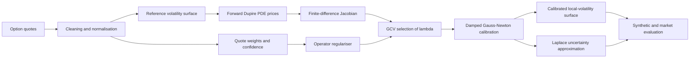

# Operator-Regularized Inverse Dupire Calibration

A reproducible Python implementation of a **deterministic-plus-Laplace pipeline** for recovering a local-volatility surface from option prices.

The project treats local-volatility calibration as an ill-posed inverse problem. It combines a forward Dupire PDE solver, log-variance parameterisation, weighted nonlinear calibration, a Schrödinger-type regulariser, generalised cross-validation (GCV), and a Laplace approximation for uncertainty quantification.

## Project highlights

- Finite-difference pricing under a two-dimensional local-volatility surface
- Raw and smoothed direct-Dupire baselines
- Stable calibration in log-variance, ensuring positive local variance
- Spatial and maturity regularisation with natural discrete Neumann boundaries
- Wing- and quote-confidence-dependent potential penalties
- Linearised and nonlinear damped Gauss–Newton inverse solvers
- Automatic regularisation-strength selection using GCV
- Laplace uncertainty bands around the calibrated surface and prices
- Synthetic recovery benchmarks, repeated-noise experiments, and an SPX case study
- **52 automated tests** covering the core numerical pipeline

## Why regularisation is needed

Dupire inversion requires derivatives of an option-price surface. Market quotes are sparse and noisy, so direct differentiation amplifies small errors and can create unstable, negative, or undefined local variances.

This project instead parameterises the local variance as

$$
u(x,T)=\log \sigma_{\mathrm{loc}}^2(x,T),
\qquad
\sigma_{\mathrm{loc}}^2(x,T)=e^{u(x,T)},
$$

and calibrates it through the nonlinear PDE pricing map \(F(u)\):

\[
\min_u
\left\|W\bigl(F(u)-C^{\mathrm{obs}}\bigr)\right\|_2^2
+
\lambda (u-u_{\mathrm{ref}})^\top R(u-u_{\mathrm{ref}}).
\]

Here:

- \(W\) contains quote weights;
- \(u_{\mathrm{ref}}\) is a fixed reference log-variance surface;
- \(\lambda\) controls the fit-versus-stability trade-off;
- \(R\) is the operator regulariser

\[
R=
\beta I
+\alpha_x D_x^\top D_x
+\alpha_T D_T^\top D_T
+\operatorname{diag}(V).
\]

The difference terms penalise roughness across log-moneyness and maturity. The potential \(V\) penalises unsupported corrections more strongly in sparse regions and in the wings. The first-difference construction leaves boundary values free and gives the natural discrete analogue of Neumann boundary conditions.

The regularisation parameter is selected by minimising a GCV score over a candidate grid rather than choosing it manually.

## Pipeline



## Main results

### Final realistic-bumpy synthetic benchmark

The final benchmark uses 136 noisy option quotes and a local-volatility surface containing both a localised positive feature and a secondary dip.

| Method | Local-volatility RMSE | MAE | Valid fraction |
|---|---:|---:|---:|
| **Operator-regularised** | **0.00571** | **0.00447** | **1.000** |
| SSVI + Dupire | 0.01195 | 0.00723 | 1.000 |
| Smoothed direct Dupire | 0.03683 | 0.01513 | 0.926 |
| Raw direct Dupire | 0.06163 | 0.02754 | 0.897 |

The operator estimate achieved a feature correlation of **0.910** with the true surface. GCV selected \(\lambda=1000\), and the nonlinear calibration stopped by relative-objective tolerance.

Across ten repeated-noise experiments, the computationally cheaper linearised operator recalibration won all ten comparisons against SSVI:

| Method | Mean RMSE | RMSE standard deviation |
|---|---:|---:|
| **Operator-regularised, linearised** | **0.00759** | **0.00101** |
| SSVI + Dupire | 0.01281 | 0.00141 |
| Smoothed direct Dupire | 0.03595 | 0.02204 |
| Raw direct Dupire | 0.04634 | 0.01464 |

### SPX market case study

The real-market experiment is deliberately reported without overstating the result. On a single held-out SPX option snapshot, SSVI produced the better predictive fit:

| Method | Held-out price RMSE | Weighted price RMSE | Implied-volatility RMSE |
|---|---:|---:|---:|
| **SSVI** | **1.1703** | **5.2366** | **0.00371** |
| Operator-regularised | 3.2024 | 8.5954 | 0.00546 |

This does not invalidate the inverse method. The synthetic experiments test local-volatility recovery against known truth, whereas the market experiment tests held-out quote fit on one cross-section. The market result shows that the operator formulation is not automatically superior to a strong parametric volatility-surface model in every setting.

## Repository structure

```text
.
├── data/
│   ├── market/                 # Bundled Cboe sample and prepared SPX quotes
│   └── synthetic/              # Synthetic benchmark quote sets
├── notebooks/                  # Fourteen sequential research notebooks
├── outputs/                    # Validated numerical results and checkpoints
├── scripts/                    # Long-running Stage 13 and Stage 14 jobs
├── src/
│   ├── bayesian/               # Laplace approximation
│   ├── data/                   # Synthetic and market-data preparation
│   ├── dupire/                 # Direct Dupire estimators
│   ├── evaluation/             # Benchmarks, SSVI and diagnostics
│   ├── inverse/                # Linearised and nonlinear calibration
│   ├── pricing/                # Black-Scholes and PDE pricing
│   ├── regularization/         # Operators, potentials and scaling
│   └── surfaces/               # Grids, smoothing and synthetic surfaces
├── tests/                      # Automated test suite
├── requirements.txt
└── README.md
```

## Notebook roadmap

| Stage | Notebook | Purpose |
|---:|---|---|
| 1 | `01_black_scholes_and_grids.ipynb` | Black-Scholes utilities and numerical grids |
| 2 | `02_local_vol_pde_pricer.ipynb` | Forward local-volatility PDE solver |
| 3 | `03_synthetic_data.ipynb` | Controlled synthetic option quotes |
| 4 | `04_dupire_baselines.ipynb` | Raw and smoothed direct-Dupire baselines |
| 5 | `05_regularization_operators.ipynb` | Difference operators, potentials and boundary treatment |
| 6 | `06_linearized_inverse.ipynb` | Weighted linearised inverse problem |
| 7 | `07_nonlinear_gauss_newton.ipynb` | Damped nonlinear calibration |
| 8 | `08_tuning_and_diagnostics.ipynb` | Scaling, GCV, ablations and residual diagnostics |
| 9 | `09_laplace_uncertainty.ipynb` | Surface and predictive uncertainty |
| 10 | `10_synthetic_benchmark.ipynb` | Smooth synthetic comparison |
| 11 | `11_localized_bump_stress_test.ipynb` | Localised-feature recovery stress test |
| 12 | `12_real_option_data_preparation.ipynb` | Offline SPX data preparation |
| 13 | `13_real_market_model_comparison.ipynb` | Held-out operator-versus-SSVI comparison |
| 14 | `14_realistic_bumpy_benchmark.ipynb` | Final repeated-noise benchmark |

## Installation

Clone the repository and create a clean environment:

```bash
git clone https://github.com/Fakhruddin12/operator-regularized-dupire.git
cd operator-regularized-dupire

conda create -n dupire_env python=3.12 -y
conda activate dupire_env
pip install -r requirements.txt
```

## Validation

Run the complete test suite from the project root:

```bash
python -m pytest tests -q
```

Expected result:

```text
52 passed
```

Launch the notebooks with:

```bash
jupyter lab
```

Run the notebooks in numerical order. Several notebooks include validated stored outputs, so the results can be inspected without repeating every expensive calibration.

## Long-running scripts

The longer market and final-benchmark calculations are also available as standalone scripts:

```bash
python scripts/13a_tune_real_market.py --project-root .
python scripts/13b_fit_compare_real_market.py --project-root .
python scripts/14_run_realistic_bumpy_benchmark.py --project-root . --mode full
```

Use `--mode quick` for a reduced Stage 14 diagnostic run. Add `--overwrite` only when intentionally replacing existing Stage 14 results.

## Surface convention

All surfaces have shape

```text
(number of maturities, number of log-moneyness points)
```

Rows correspond to maturities and columns to log-moneyness. Arrays are flattened in C order, so log-moneyness varies fastest.

## Scope and limitations

- The primary evidence is based on controlled synthetic recovery experiments.
- The market study uses one SPX snapshot and should not be interpreted as broad empirical dominance.
- The Jacobian is constructed by finite differences, which is transparent but computationally expensive.
- The Laplace approximation is local and approximately Gaussian around the calibrated solution.
- This repository is a research and educational implementation, not a production trading or risk system.

## Author

**Fakhruddin Hussain**  
MSc Statistics with Data Science, University of Edinburgh  
Quantitative research portfolio project

## References

- Dupire, B. (1994). *Pricing with a Smile*. Risk.
- Gatheral, J. and Jacquier, A. (2014). *Arbitrage-free SVI volatility surfaces*. Quantitative Finance.
